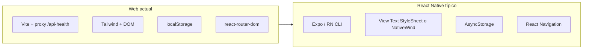

# Análisis: complejidad de migrar a React Native

## Qué es hoy el proyecto

- **Stack**: [package.json](package.json) — React 19, Vite 7, Tailwind 4 (`@tailwindcss/vite`), `react-router-dom`, `react-markdown` + `remark-gfm`.
- **Entrada**: [src/main.tsx](src/main.tsx) monta `BrowserRouter` + `ThemeProvider` + rutas en [src/Links.tsx](src/Links.tsx): `/` ([Landing.tsx](src/pages/landing/Landing.tsx)), `/app` ([Body.tsx](src/pages/main/componets/Body.tsx)), `/agente` ([Agente.tsx](src/pages/agente/components/Agente.tsx)).
- **Tamaño**: pocos archivos TS/TSX (~15); el volumen real está en **un componente muy grande** (`Body.tsx`, ~1300 líneas) con layout responsive, modales, lista/detalle y subida de imagen.

## Qué se reutiliza con poco esfuerzo

- **Lógica pura**: [src/lib/mealNutritionMapper.ts](src/lib/mealNutritionMapper.ts) (tipos y transformaciones) puede copiarse casi tal cual.
- **Contratos HTTP**: las llamadas `fetch` a los mismos paths bajo `/api/...` son válidas en RN; solo hay que **unificar la URL base** (hoy [src/lib/healthApi.ts](src/lib/healthApi.ts) usa `import.meta.env.DEV` y el proxy de Vite; en móvil no existe ese proxy → URL directa al backend o variable de entorno tipo Expo `EXPO_PUBLIC_...`).
- **Zona horaria / día local**: [src/lib/browserDayContext.ts](src/lib/browserDayContext.ts) (`Intl`, `localCalendarDay`, `URLSearchParams`) funciona en Hermes/JavaScriptCore de forma análoga al navegador; renombrar “browser” es cosmético.

## Qué obliga a reescritura (donde está el coste)

| Área | Web hoy | En React Native |
|------|-----------|-----------------|
| UI | `div`, `button`, `input`, Tailwind, CSS modules, Material Symbols vía CSS | `View`, `Pressable`, `TextInput`, `Image`, estilos (`StyleSheet` o **NativeWind**/Tamagui, etc.) e iconos (`@expo/vector-icons` u otro) |
| Navegación | `react-router-dom`, `useNavigate` | `@react-navigation/native` (stack/tabs) o Expo Router |
| Tema | `document.documentElement.classList`, `matchMedia`, `localStorage` ([ThemeContext.tsx](src/lib/ThemeContext.tsx)) | `useColorScheme` + persistencia en **AsyncStorage** + contexto sin DOM |
| Persistencia | `localStorage` ([activeUserStorage.ts](src/lib/activeUserStorage.ts), [objectiveProgressStorage.ts](src/lib/objectiveProgressStorage.ts)) | **AsyncStorage** (API async; adaptar lecturas iniciales) |
| Imagen | `<input type="file">`, `FileReader`, `URL.createObjectURL` ([Body.tsx](src/pages/main/componets/Body.tsx)) | `expo-image-picker` / `react-native-image-picker` + lectura a **base64** desde URI |
| Compartir / portapapeles | `navigator.share` / `clipboard` | `Share` de RN, `expo-clipboard` |
| Chat markdown | `react-markdown` con nodos HTML y clases Tailwind ([ChatMarkdown.tsx](src/pages/agente/components/ChatMarkdown.tsx)) | **Sustituto nativo** (`react-native-markdown-display`, Markdown en WebView, o render propio limitado) — es uno de los puntos más delicados si quieres paridad visual |
| Landing | `IntersectionObserver`, `querySelectorAll`, estilos en CSS module ([Landing.tsx](src/pages/landing/Landing.tsx)) | Rehacer animaciones con **Reanimated** / `Animated` o simplificar marketing |
| Efectos web | `scrollIntoView`, `requestAnimationFrame` para foco ([Agente.tsx](src/pages/agente/components/Agente.tsx)) | `FlatList`/`ScrollView` + `scrollToEnd`, `InteractionManager` |
| Slider meta kcal | `<input type="range">` | `@react-native-community/slider` o control custom |
| Fuentes | Google Fonts en [src/index.css](src/index.css) | `expo-font` + assets |

## Backend / despliegue

- En web, desarrollo evita CORS con el **proxy de Vite** hacia `health-api-theta.vercel.app` ([vite.config.ts](vite.config.ts)). En iOS/Android la app llama al origen real: hay que confirmar que el API permite el origen móvil o que no hay restricciones que bloqueen (CORS no aplica igual que en navegador, pero políticas del servidor y TLS siguen siendo relevantes).

## Estimación de complejidad

- **Esfuerzo relativo**: **medio**. No es un monorepo enorme ni hay muchas integraciones nativas en web, pero **casi toda la UI hay que volver a construirla** en primitivas de RN; `Body.tsx` concentra la mayor parte del tiempo.
- **Riesgos**: paridad del chat Markdown; flujo de fotos (permisos, compresión, tamaño de payload); y definir **un solo sistema de diseño** en RN (evitar mezclar mil estilos inline).
- **Camino recomendado**: **Expo** (gestión de assets, picker, build) + React Navigation + AsyncStorage; extraer primero hooks/servicios (`healthApi`, loaders, `mealNutritionMapper`) y luego pantallas.

## Conclusión

Para un equipo habituado a React Native: **proyecto migrable en un sprint corto a mediano** según nivel de pulido (solo funcional vs. pixel-perfect). Para alguien sin experiencia RN: la curva es la de RN + navegación + estilos, no la de “entender el dominio”, que ya está encapsulado en pocos módulos.

No se requieren decisiones del usuario para este análisis; si más adelante migráis, las bifurcaciones importantes serían: **Expo vs bare RN**, **NativeWind vs StyleSheet**, y **cómo renderizar Markdown** en el agente.
